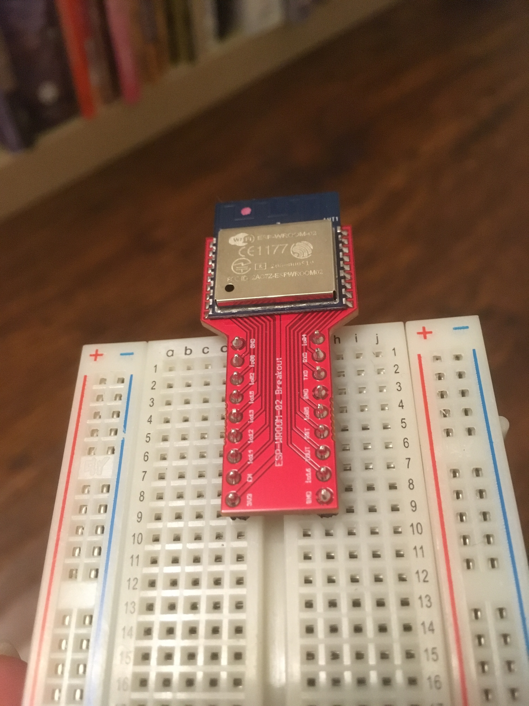

# esp-wroom-02-breakout
A breakout board for the Arduino-compatible Espressif ESP-WROOM-02 module.

* Designed with connectors for use on a breadboard
* Because the module is wide, the narrow width of the breakout board frees up more room for connections on the breadboard
* Connectors follow the same relative ordering as the module contacts (although it is reversed)

