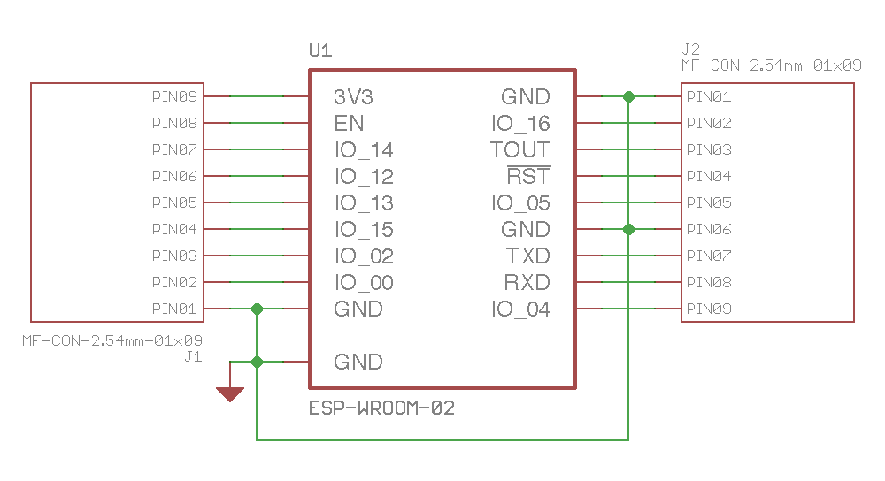
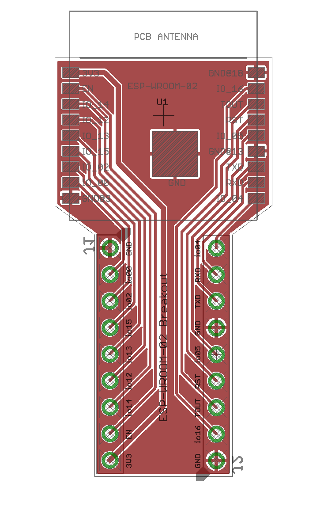

# esp-wroom-02-breakout
A breakout board for the Arduino-compatible Espressif ESP-WROOM-02 module.

* Designed with connectors (J1 and J2) that will fit in a breadboard
* Because the module is sort of wide, the narrow width of the breakout board frees up more room for connections on the breadboard
* Connectors follow the same relative ordering as the module contacts

